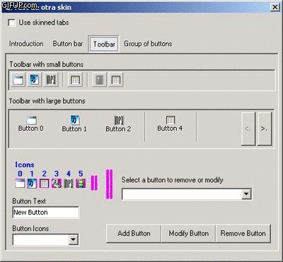



## cButtonBar \(Updated 03\-DIC\-09\)

### Description

This is a class that simulates a button bar using a picturebox as a drawing surface. It can be used as a Toolbar, as a collection of tabs, as an only button or a group of buttons, or anything else that you can imagine.

I hope it would be useful for anyone.

Some of the features of this class/control were taken from the code MyButton - Dva oka njena (Default &amp; Cancel) http://www.Planet-Source-Code.com/vb/scripts/ShowCode.asp?txtCodeId=41271&amp;lngWId=1

There are both an english and spanish version.
 
### More Info
 

             |
---                |---
**Submitted On**   |2008-04-25 09:09:04
**By**             |[Esteban Gonzalez](https://github.com/Planet-Source-Code/PSCIndex/blob/master/ByAuthor/esteban-gonzalez.md)
**Level**          |Advanced
**User Rating**    |4.8 (53 globes from 11 users)
**Compatibility**  |VB 6\.0
**Category**       |[Custom Controls/ Forms/  Menus](https://github.com/Planet-Source-Code/PSCIndex/blob/master/ByCategory/custom-controls-forms-menus__1-4.md)
**World**          |[Visual Basic](https://github.com/Planet-Source-Code/PSCIndex/blob/master/ByWorld/visual-basic.md)
**Archive File**   |[cButtonBar2169251232009\.zip](https://github.com/Planet-Source-Code/esteban-gonzalez-cbuttonbar-updated-03-dic-09__1-70385/archive/master.zip)

